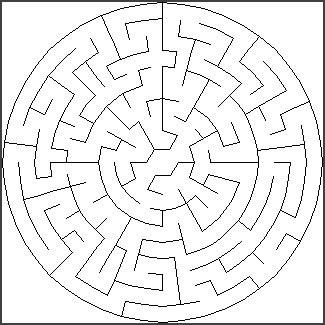
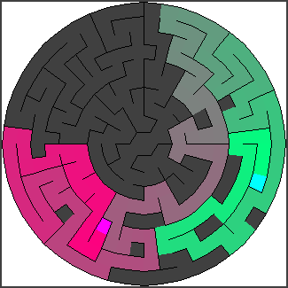
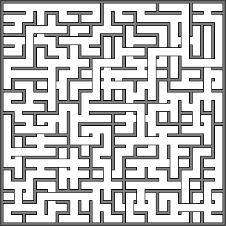
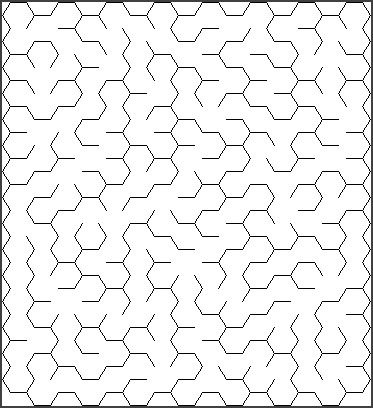
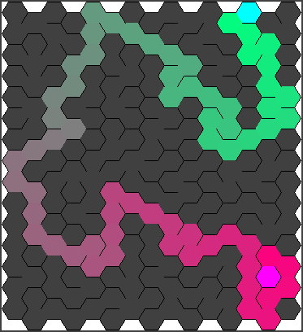

# Maze Generator
This is a pet project for me to learn and experiment Functional Programming and Scala. The project is based on the book: [Maze for Programmer](http://www.mazesforprogrammers.com/).

# Gallery

| Algorithm | Maze | Path |
|:---:|:---:|:---: |
|Recursive Backtrack|||
|Wilson|||
|Aldous Broder|||

Animation
---

