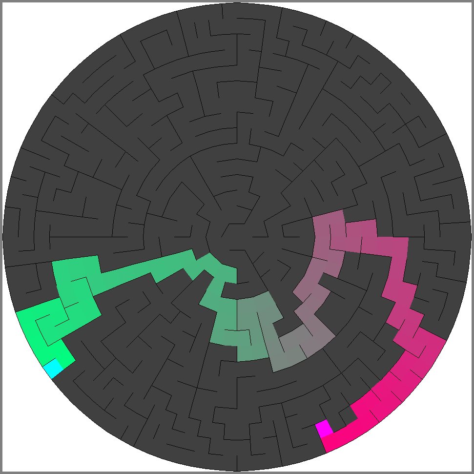
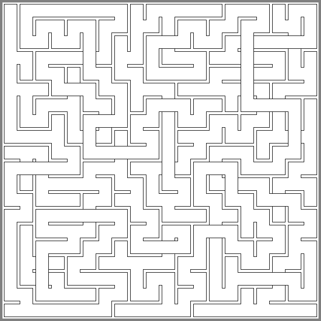
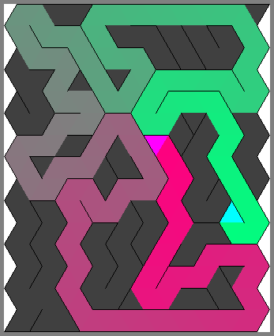

# Maze Generator
This is a pet project for me to learn and experiment Functional Programming and Scala. The project is based a book: [Maze for Programmer](http://www.mazesforprogrammers.com/). Now I'm (slowly) refactoring the code on the branch: `new_class_design`.

# Gallery
Circular Maze (Braided) with a Path:

Weaved Maze

Triangle Maze with a Path:

